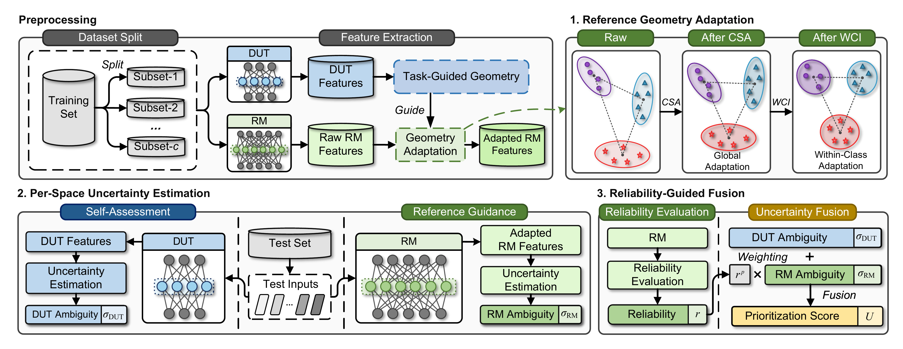

# ReMaP - Official Implementation

  [](https://github.com/Ryan-LHR/ReMaP) [](https://huggingface.co/datasets/haoran1999/ReMaP-Reproducibility-Resources) [](LICENSE)

This repository contains the implementation of ReMaP (**Re**ference **M**odel **a**udited **P**rioritization), a test input prioritization method for DNNs proposed in our paper:
**From Self-Assessment to Reference Guidance: Test Input Prioritization for DNNs with Foundation Models.**



## Structure

```text
ReMaP/
├── baselines/  # Implementation of baseline methods
├── configs/  # Configuration files
│   └── rq1.toml
├── data/  # Data storage
│   ├── datasets/
│   └── models/
├── figures/
│   └── remap_overview.png  # Overview of ReMaP
├── main/
│   ├── main.py
│   ├── parse.py
│   └── run_rq1.py  # Used to run experiments
├── utils/
│   ├── candidate/  # Candidate set construction
│   ├── dufp/  # Shared feature-space uncertainty modules
│   ├── load_data/
│   ├── models/  # Model definitions
│   └── remap/  # Core modules of ReMaP
├── LICENSE
└── environment.yml
```

## Datasets and Models

The datasets and pretrained DNN models used in the experiments are available from the [ReMaP reproducibility resources on Hugging Face](https://huggingface.co/datasets/haoran1999/ReMaP-Reproducibility-Resources) in `.rar` archive format.
The datasets are provided as a multi-volume archive (`datasets.part01.rar` through `datasets.part13.rar`), while the model artifacts are provided in `models.rar`.
Download all dataset volumes into the same directory before extraction.

Before running the project, please extract all downloaded `.rar` files and then place the extracted contents into the following folders in the repository:

- `data/datasets/` — for storing datasets
- `data/models/` — for storing pretrained model files

## Setup

### Configuration

The experimental platform was a workstation running Ubuntu 20.04, with an Intel Xeon Platinum 8352V CPU, an NVIDIA RTX 4090 GPU, and 90 GB of memory.
The software environment was based on **Python 3.8** and **PyTorch 1.12.0**.

### Install Dependencies

```bash
conda env create -f environment.yml
conda activate test_selection
```

## Usage

The work directory is `ReMaP/main`.

### Step 1: Configure Arguments

Edit `configs/rq1.toml` to specify the methods and models to be evaluated.
Available choices can be found in the corresponding `.toml` file.

#### Example

```toml
methods = [
    # Coverage-based methods
    "nac-ctm", "nac-cam", "kmnc-ctm", "kmnc-cam",

    # Surprise-based methods
    "lsa", "pc-lsa", "pc-mlsa", "pc-dsa", "pc-mdsa", "pc-mmdsa",

    # Uncertainty-based methods
    "deepgini", "maxp", "margin", "entropy", "lof", "fast", "nns",

    # Mechanism-based methods
    "nss", "ats", "rts", "certpri", "prima", "datis_no_selection",
    "dufp",

    # Selection methods
    "sets", "mcp_official", "datis",

    # Our proposed method
    "remap",  # our proposed method

    # Reference-guided uncertainty fusion ablation (RQ4.1)
    "remap_fuse(student_only)",  # ablation using DUT-derived uncertainty only
    "remap_fuse(teacher_only)",  # ablation using RM-derived uncertainty only

    # Reference geometry adaptation ablation (RQ4.2)
    "remap_omega(0)",  # ablation for cross-space alignment
    "remap_beta(0)",  # ablation for within-class isotropization
    "remap_beta(0)_omega(0)",

    # Reference model ablation (RQ4.3)
    "remap_teacher(dinov2_vitb14)",
    "remap_teacher(siglip_so400m)",
    "remap_teacher(sup_vitl16)",
]

models = [
    "MNIST-LeNet5", "FM-ResNet20", "C10-ResNet20",
    "SVHN-VGG16", "IM100Test-deit_base_patch16_224",
    "ModelNet40-DGCNN", "ESC50-AST",
]

cand_types = ["nominal", "corrupted", "adversarial"]
```

> **Tip:** ModelNet40-DGCNN and ESC50-AST are evaluated only under the nominal setting.
> Set `cand_types = ["nominal"]` when running either model.

### Step 2: Run Experiments

Run `python run_rq1.py` in the work directory.

### Tip

It should be noted that `run_rq1.py` does not only include the experiments for **RQ1**.
The same script also conducts test input selection (**RQ2**), efficiency evaluation (**RQ3**), and ablation studies (**RQ4**).

The **APFD**, **TRC**, and **Time Cost** metrics corresponding to RQ1, RQ2, and RQ3, respectively, are reported after the execution is completed.
The ReMaP variants used for RQ4 can be configured in `rq1.toml` by adjusting the `methods` parameter, where sufficient examples are provided.

**If you encounter any issues during implementation, please feel free to contact us.**

## Extending ReMaP

ReMaP can be extended to new testing subjects by configuring the DUT, RM, and modality-specific data pipeline as needed.

### Test a New DNN Model

To evaluate a new DNN model using our method, configure the following components:

1. **Specify model information**
   In `parse.py`, add the model name, model storage directory, and the corresponding dataset name.

2. **Implement the dataset loader**
   Under `utils/load_data/`, add a loader that reads and preprocesses the corresponding dataset in the format expected by the existing pipeline.

3. **Define the target feature space**
   In `utils/dufp/dufp_utils.py`, specify the model's target feature layer in `get_target_layer_name`.
   This layer serves as the DUT feature space for ReMaP.

After these configurations, the new model can be tested in the same way as the existing ones.

### Use a Different Reference Model

To use another pre-trained foundation model as the RM for an existing modality, configure the following components:

1. **Register the reference model**
   In the corresponding module under `utils/remap/teacher_extractor/`, specify the model identifier and revision together with any model-specific preprocessing or feature extraction required.

2. **Select the reference model**
   Select the registered model in `configs/rq1.toml` using `remap_teacher(<model_name>)`.

3. **Set the default reference model (optional)**
   To use the registered model by default for its modality, update `DEFAULT_TEACHER_BY_MODALITY` in `utils/remap/remap.py`.

### Support a New Dataset

For a new dataset whose modality is already supported, complete the following steps:

1. **Implement the dataset loader**
   Under `utils/load_data/`, add a loader that reads and preprocesses the training and test sets in the format expected by the existing pipeline.

2. **Register the dataset**
   In `utils/load_data/load_data.py`, add the dataset to the corresponding modality-specific list.
   The existing RM extractor for that modality can then be reused.

### Support a New Modality

To support an entirely new modality, configure the following components:

1. **Implement the dataset loader**
   Under `utils/load_data/`, add a loader that reads and preprocesses the training and test sets for the new modality.

2. **Register the modality**
   In `utils/load_data/load_data.py`, register the new modality in `DATASET_MODALITY` and route its datasets to the corresponding loader.

3. **Implement a modality-specific RM extractor**
   Under `utils/remap/teacher_extractor/`, implement the RM loading, input preprocessing, and feature extraction procedures.

4. **Register the RM extractor**
   In `load_teacher_features` in `extractor.py`, route the registered RM to its modality-specific extractor.

5. **Set the default reference model**
   Add the default RM for the new modality to `DEFAULT_TEACHER_BY_MODALITY` in `utils/remap/remap.py`.

## Citation

```bibtex
@article{remap,
  title   = {From Self-Assessment to Reference Guidance: Test Input Prioritization for DNNs with Foundation Models},
  author  = {To be updated},
  journal = {To be updated},
  year    = {2026},
  note    = {Paper information will be added after publication}
}
```
